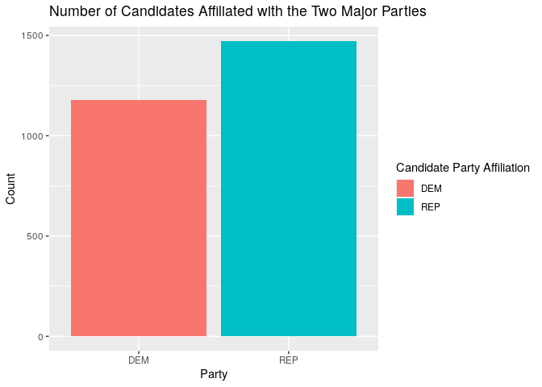

<!-- README.md is generated from README.Rmd. Please edit that file -->

# fec12 

<!-- badges: start -->

[](https://www.tidyverse.org/lifecycle/#maturing)
[](https://CRAN.R-project.org/package=fec12)
[](https://travis-ci.org/baumer-lab/fec12)
<!-- badges: end -->

**fec12** contains data from the [Federal Election Commission
(FEC)](https://www.fec.gov/) website pertaining to candidates,
committees, results, contributions from committees and individuals, and
other financial [data for the United States 2011-2012 election
cycle](https://www.fec.gov/data/browse-data/?tab=bulk-data).
Additionally, for the datasets that are included as samples, the package
includes functions that import the full versions.

Please see [**fec16**](https://www.github.com/baumer-lab/fec16), a
similar package that is on CRAN, for more documentation and examples.

## Installation

`fec12` is hosted on GitHub and call be installed by running the
following:

``` r
devtools::install_github("baumer-lab/fec12")
```

``` r
library(fec12)
```

## Datasets Included

### Full Datasets

  - `candidates`: candidates registered with the FEC during the
    2011-2012 election cycle
  - `committees`: committees registered with the FEC during the
    2011-2012 election cycle
  - `campaigns`: the house/senate current campaigns
  - `results_house`: the house results of the 2012 general presidential
    election
  - `results_senate`: the senate results of the 2012 general
    presidential election
  - `results_president`: the final results of the 2012 general
    presidential election
  - `pac`: Political Action Committee (PAC) and party summary financial
    information

### Sample Datasets (with 1000 random rows each)

  - `individuals`: individual contributions to candidates/committees
    during the 2012 general presidential election
  - `contributions`: candidates and their contributions from committees
    during the 2012 general election
  - `expenditures`: the operating expenditures
  - `transactions`: transactions between committees

## Functions Included

The following functions retrieve the entire datasets for the sampled
ones listed above. The size of the raw file that is downloaded by
calling each function is given for reference. All functions have an
argument `n_max` which defaults to the entire dataset but the user can
specify the max length of the dataset to be loaded via this argument.

  - `read_all_individuals()` \~ 250.6MB
  - `read_all_contributions()` \~ 12.2MB
  - `read_all_expenditures()` \~ 45.4MB
  - `read_all_transactions()` \~ 35.6MB

## Examples

### Data Wrangling

`fec12` can be used to summarize data in order see how many candidates
are running for elections (in all offices) for the two major parties:

``` r
library(dplyr)

data <- candidates %>%
  filter(cand_pty_affiliation %in% c("REP", "DEM")) %>%
  group_by(cand_pty_affiliation) %>%
  summarize(size = n())

data
#> # A tibble: 2 x 2
#>   cand_pty_affiliation  size
#>   <chr>                <int>
#> 1 DEM                   1180
#> 2 REP                   1472
```

### Data Visualization

We can visualize the above data:

``` r
library(ggplot2)

ggplot(data, aes(x = cand_pty_affiliation, y = size, fill = cand_pty_affiliation)) +
  geom_col() +
  labs(
    title = "Number of Candidates Affiliated with the Two Major Parties",
    x = "Party", y = "Count", fill = "Candidate Party Affiliation"
  )
```



## Contributors

  - [Marium Tapal](https://github.com/mariumtapal)
  - [Irene Ryan](https://github.com/ireneryan)
  - [Rana Gahwagy](https://github.com/ranawg)
  - [Benjamin S. Baumer](https://github.com/beanumber)
